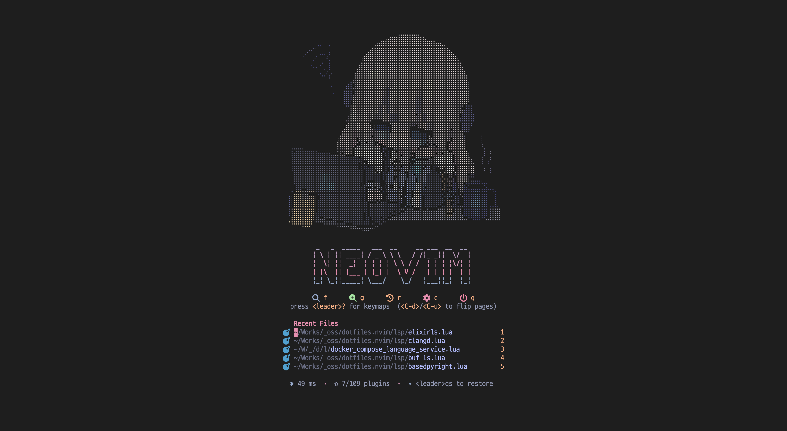

# Neovim Configuration

Lean, fast, easy on the eyes. Native LSP (`vim.lsp.config`), Rust-backed completion (blink.cmp), aggressive lazy-loading. Lazy.nvim manages plugins, Mason handles the LSP/DAP toolchain.

> **Targets Linux and macOS, in [Kitty](https://sw.kovidgoyal.net/kitty/) terminal.** WSL2 is supported (clipboard bridges to Windows via `clip.exe`). Other terminals work for everything except inline image / GIF / video previews and the Material Design Icons font fallback, which both rely on Kitty.
>
> Pairs well with the companion Kitty config at [`miniex/dotfiles.kitty`](https://github.com/miniex/dotfiles.kitty) — drop it into `~/.config/kitty` for the matching font fallback, theme, and keymaps this setup is tuned against.



## Highlights

- **Native LSP, deferred everything** — `vim.lsp.config` + `vim.lsp.enable` directly; Mason install runs on `VimEnter`. Most plugins lazy via `VeryLazy` / `cmd` / `keys` / `ft`
- **Completion & diagnostics** — blink.cmp (Rust fuzzy), inlay hints suppressed during insert, tiny-inline-diagnostic on cursor line with `<leader>cl` to toggle native `virtual_lines`
- **Treesitter** — nvim-treesitter `main` + textobjects, sticky context, ts-autotag (HTML/JSX), ts-context-commentstring
- **Pickers** — fff.nvim (Rust-backed file finder, sub-10ms on huge repos) + snacks.picker for grep / buffers / help / recent
- **Editor** — neo-tree, flash, trouble, which-key, todo-comments, dropbar (winbar breadcrumb), persistence (sessions), hex view via `xxd`
- **snacks.nvim** — picker, profiler, terminal, dashboard, statuscolumn, notifier, indent, scroll, dim, image, bigfile, scope, words
- **Tooling** — nvim-lint, mason-tool-installer, DAP for Rust / C-C++ / Python (formatting is opt-in via `tools/format.sh`, not on save)
- **UI** — Cyberdream theme + lualine + smear-cursor + modicator + fidget + undo-glow
- **Git** — gitsigns, fugitive, lazygit.nvim, blink-cmp-git commit completions
- **WSL2** clipboard bridge via `clip.exe`

## Language Support

Sorted by language category, then family, then first-appeared.

| Language            | LSP                           | Linter        | Debugger |
|---------------------|-------------------------------|---------------|----------|
| Shell (sh/bash)     | bashls                        | shellcheck    | -        |
| Zsh                 | -                             | zsh -n        | -        |
| Fish                | -                             | fish -n       | -        |
| Assembly            | asm-lsp                       | -             | -        |
| C/C++               | clangd                        | -             | cpptools |
| Go                  | gopls                         | -             | -        |
| Rust                | rust-analyzer                 | -             | CodeLLDB |
| Zig                 | zls                           | -             | -        |
| OCaml               | ocamllsp                      | -             | -        |
| Elixir              | elixirls                      | -             | -        |
| Python              | basedpyright + ruff           | ruff (LSP)    | debugpy  |
| Lua                 | lua_ls                        | -             | -        |
| CSS / HTML          | cssls / html+emmet            | -             | -        |
| Tailwind CSS        | tailwindcss                   | -             | -        |
| JavaScript/TS       | vtsls                         | eslint_d      | -        |
| GraphQL             | graphql                       | -             | -        |
| SQL                 | sqls                          | -             | -        |
| JSON / YAML         | jsonls / yamlls               | -             | -        |
| Protobuf            | buf_ls                        | -             | -        |
| TOML                | taplo                         | -             | -        |
| RON                 | -                             | -             | -        |
| Typst               | tinymist                      | -             | -        |
| Markdown            | marksman                      | markdownlint  | -        |
| MDX                 | marksman + mdx_analyzer       | -             | -        |
| CMake               | neocmake                      | -             | -        |
| Nix                 | nil_ls                        | statix        | -        |
| Dockerfile          | dockerls                      | hadolint      | -        |
| Helm                | helm_ls                       | -             | -        |
| Terraform / HCL     | terraformls                   | tflint        | -        |
| Shaders (WGSL/GLSL) | wgsl-analyzer / glsl_analyzer | -             | -        |
| Just                | just (just-lsp)               | -             | -        |

> Formatting is intentionally not wired into the editor. Run `tools/format.sh` (stylua + shfmt) for the repo's own files; per-language formatting is left to whatever each contributor prefers.

## Setup

### Prerequisites

- **Neovim ≥ 0.12.0**
- `git`, `tar`, `curl`, `xxd`, C compiler, `make`, ripgrep
- A [Nerd Font](https://www.nerdfonts.com/) **plus** [`Symbols Nerd Font Mono`](https://github.com/ryanoasis/nerd-fonts/releases/latest/download/NerdFontsSymbolsOnly.zip) installed as a fallback — many devicons here are Material Design Icons in the Supplementary PUA (U+F0001–U+F1FFF), which most patched Nerd Fonts don't ship. In Kitty, add `symbol_map U+E000-U+F8FF,U+F0000-U+10FFFD Symbols Nerd Font Mono` to `kitty.conf`
- [`tree-sitter-cli`](https://github.com/tree-sitter/tree-sitter) **≥ 0.26.1** — `cargo install tree-sitter-cli` or OS package manager. **Not npm.**
- Node.js + npm — runtime for npm-based Mason packages (vtsls, eslint_d, marksman, dockerls, tailwindcss-language-server, …)
- Python 3 + pip — required by debugpy
- Go toolchain — required by Mason to install gopls, helm_ls, sqls, terraformls, tflint
- Rust toolchain — required for fff.nvim's binary build (rust-analyzer, tinymist, wgsl-analyzer, glsl_analyzer are Mason-installed)
- Zig toolchain — optional, only if `zig = true`; Mason builds zls from source
- OCaml + opam — optional, only if `ocaml = true`; ocamllsp installs through opam (`opam install ocaml-lsp-server`) rather than Mason
- Erlang + Elixir + mix — optional, only if `elixir = true`; required for elixirls
- [`just`](https://github.com/casey/just) — optional, runner for Justfile recipes (Mason only ships `just-lsp`, not the CLI)
- [lazygit](https://github.com/jesseduffield/lazygit) — optional, for `<leader>gg`

### Install

**Recommended** — one-shot installer (backs up existing `~/.config/nvim` and `~/.local/share/nvim`, clones the repo, optionally launches the language picker):

```bash
sh -c "$(curl -fsSL https://raw.githubusercontent.com/miniex/dotfiles.nvim/main/install.sh)"
```

**Manual** — if you'd rather wire it up yourself:

```bash
mv ~/.config/nvim ~/.config/nvim.backup
mv ~/.local/share/nvim ~/.local/share/nvim.backup
git clone https://github.com/miniex/dotfiles.nvim.git ~/.config/nvim
sh ~/.config/nvim/set-lang.sh   # optional — pick which language plugins to load
nvim
```

Plugins, LSP servers, linters, and DAP adapters install via Mason on first launch. Treesitter parsers download/build asynchronously — re-open files if highlight is briefly missing.

> **If something breaks after `git pull`** — Lazy's compiled spec cache or a stale plugin version is the usual culprit. Nuke local nvim state and restart:
>
> ```bash
> rm -rf ~/.local/share/nvim ~/.local/state/nvim ~/.cache/nvim
> ```
>
> This wipes plugins, Mason packages, treesitter parsers, undo history, shada, and LSP logs. Plugins and tooling reinstall on next launch.

## Key Bindings

Leader: `<Space>`

### Global
| Key | Mode | Description |
|---|---|---|
| `<C-h/j/k/l>` | N/T | Pane navigation with tmux-style return-to-last (works from terminal mode too; smear animation pulses on entering a terminal pane, then disables itself so typing stays jitter-free) |
| `<leader>h` | N | Clear search highlight |
| `<leader>s` | N | Save |
| `<leader>d` | N/V | Delete without yank |
| `<leader>p` | V | Paste without overwriting register |
| `<` / `>` | V | Indent/outdent (keep selection) |

### Find & Navigate
| Key | Description |
|---|---|
| `<leader>ff` | fff.nvim: find files (Rust-backed, sub-10ms on huge codebases) |
| `<leader>fF` | fff.nvim: find files in current directory |
| `<leader>fg` / `fr` / `fb` / `fh` | snacks.picker: grep / recent / buffers / help |
| `<leader>ft` | TODO comments (snacks.picker) |
| `<leader>e` / `<leader>o` | Neo-tree: toggle / reveal current file |
| `s` / `S` (n/x/o) | Flash: jump / treesitter jump |
| `<leader>?` | which-key: buffer-local keymaps |

### Session (persistence.nvim)
| Key | Description |
|---|---|
| `<leader>qs` | Restore session for cwd |
| `<leader>qS` | Select session from list |
| `<leader>ql` | Restore last session |
| `<leader>qd` | Don't save current session on exit |

### Profiler (snacks.nvim)
Use `PROF=1 nvim` to profile startup, or these runtime keys:
| Key | Description |
|---|---|
| `<leader>pp` | Toggle profiler |
| `<leader>ps` | Open profiler scratch buffer |
| `<leader>pf` | Pick from captured profile |
| `<leader>ph` | Toggle profiler highlights |

### LSP / Diagnostics
| Key | Description |
|---|---|
| `K` / `<C-k>` (i) | Hover / signature help |
| `gd` / `gr` / `gi` | Definition / references / implementation |
| `<leader>rn` | Rename symbol |
| `<leader>cc` / `<leader>ca` | Diagnostics float / code action |
| `<leader>ci` | Toggle inlay hints |
| `<leader>cd` / `<leader>cl` | Toggle inline diagnostic / multi-line `virtual_lines` |
| `<leader>cm` | Open Mason |
| `<leader>xx/xd/xs/xq/xl` | Trouble: diagnostics / buf only / symbols / qf / loclist |
| `<leader>xt` / `<leader>xT` | Trouble: TODOs / TODO+FIX+FIXME |
| `[q` / `]q` | Prev / next item (Trouble + qf fallback) |
| `[t` / `]t` | Prev / next TODO comment |

### Treesitter Textobjects & Context
| Key | Mode | Description |
|---|---|---|
| `af` / `if` | x/o | Function (outer / inner) |
| `ac` / `ic` | x/o | Class (outer / inner) |
| `aa` / `ia` | x/o | Parameter / argument (outer / inner) |
| `ai` / `ii` | x/o | Conditional (outer / inner) |
| `al` / `il` | x/o | Loop (outer / inner) |
| `a/` / `i/` | x/o | Comment (outer / inner) |
| `]f` / `[f` | n/x/o | Next / prev function start |
| `]F` / `[F` | n/x/o | Next / prev function end |
| `]c` / `[c` | n/x/o | Next / prev class start |
| `<leader>uc` | n | Toggle treesitter context (sticky function header) |
| `[x` | n | Jump to context start |

### Winbar Breadcrumb (dropbar)
| Key | Description |
|---|---|
| `<leader>uw` | Pick segment to jump to |
| `[w` / `]w` | Jump to context start / next context |

### Git
| Key | Description |
|---|---|
| `<leader>gs/gb/gd/gl/gc/gp/gP` | Fugitive: status/blame/diff/log/commit/push/pull |
| `<leader>gg` / `gf` / `gF` / `gL` | LazyGit: full / current file / filter file / filter all |
| `[h` / `]h` | Prev / next hunk |
| `<leader>ghs/r/S/u/R/p/i/b/d/D` | Stage / reset / stage-buf / undo-stage / reset-buf / preview / inline-preview / blame-line / diff / diff~ |
| `<leader>gtb` / `<leader>gtd` | Toggle line blame / show deleted |

### Debugger (DAP)
| Key | Description |
|---|---|
| `<leader>db` / `dB` | Toggle / conditional breakpoint |
| `<leader>dc` / `dC` | Continue / run-to-cursor |
| `<leader>di` / `dO` / `do` | Step into / over / out |
| `<leader>dg` / `dj` / `dk` | Go to line (no execute) / Down / Up frame |
| `<leader>dl/dr/dp/dt/ds/du` | Last / REPL / pause / terminate / session / toggle UI |
| `<leader>dPt` / `<leader>dPc` | Python: debug test method / class |

### Terminal & Buffers (snacks.nvim)
| Key | Description |
|---|---|
| `<leader>t` (n/t) | Toggle terminal (45% bottom split, anchored below main window — auto-skips neo-tree) |
| `<C-x>` | Hide terminal |
| `<leader>bd` | Smart buffer delete |
| `<leader>cn` / `<leader>un` | Notification history / dismiss all |
| `]]` / `[[` | LSP word: next / previous reference |

### Language-specific
| Key | Description |
|---|---|
| `<leader>ch` | C/C++: switch source ↔ header |
| `<leader>cR` / `<leader>cD` | Rust: code action / debuggables (rustaceanvim) |

### Hex (hex.nvim — requires `xxd`)
`:HexToggle`, `:HexDump`, `:HexAssemble`, or `nvim -b <file>`.

### Completion (insert mode)
`<Tab>` / `<S-Tab>` next/prev · `<C-Space>` trigger · `<CR>` confirm · `<C-e>` close · `<C-f>` / `<C-S-f>` scroll docs.

## Customization

- **Disable languages you don't use** — run `sh ~/.config/nvim/set-lang.sh` for an interactive picker (↑/↓, space to toggle, enter to save), or hand-edit `lua/config/langs_local.lua` (gitignored) directly. Either way it overrides the defaults in `lua/config/langs.lua` per-machine without polluting upstream.
- **New language** — add a file under `lua/plugins/lang/` extending `nvim-lspconfig` `servers` (auto-installed via mason-lspconfig's `ensure_installed`, populated dynamically), then add the module name to `lua/config/langs.lua` so it gets imported. Linters live in `lua/plugins/lsp/lint.lua` (extend `opts.linters_by_ft`), treesitter parsers in `lua/plugins/editor/treesitter.lua`. Non-LSP tools (linters, DAP adapters) install through `WhoIsSethDaniel/mason-tool-installer.nvim` — extend its `opts.ensure_installed`. `python.lua` shows the LSP + DAP wiring.
- **Theme** — `lua/plugins/ui/themes.lua`.
- **Keymaps** — `lua/config/keymaps.lua`, helper `map(lhs, rhs, mode, desc)`.
- **Autocmds** — `lua/config/autocmds.lua` (treesitter attach, WSL2 clipboard, file reload, end-of-buffer tilde hide).
- **Diagnostic styling** — `lua/plugins/lsp/init.lua` `config()` (signs, virtual_text, float border). Loaded only on first buffer (`BufReadPre`) so it doesn't cost startup time.
- **Contributor tools** — `tools/format.sh` (stylua + shfmt) and `tools/lint.sh` (stylua check, lua-language-server diagnostics, shfmt diff, shellcheck). See [CONTRIBUTING.md](CONTRIBUTING.md).

## Contributing

PRs welcome. Before opening one:

- Run `./tools/format.sh` and `./tools/lint.sh` — both must pass clean.
- Follow the commit prefix convention (`feat:`, `fix:`, `refactor:`, `docs:`, …, all lowercase).

Full details in [CONTRIBUTING.md](CONTRIBUTING.md).

## Troubleshooting

| Issue | Check |
|---|---|
| LSP not attaching | `:Mason`, `:LspInfo`, `:LspLog` |
| Lint not running | linter on `$PATH`, see `lua/plugins/lsp/lint.lua` |
| Mason tools missing | `:MasonToolsUpdate`, then `:Mason` to confirm |
| `<leader>ff` not working | fff.nvim's binary failed to download/build; run `:Lazy build fff.nvim` (Rust toolchain on `$PATH`) |
| Sessions not loading | `:lua require('persistence').list()` to inspect; `<leader>qS` to pick |
| Profiling startup | `PROF=1 nvim`, then `<leader>pp` to toggle, `<leader>pf` to pick captured frames |
| Vim plugin needs python3/ruby/perl/node provider | All four are disabled by default in `lua/config/globals.lua` for startup speed — remove the `loaded_*_provider` line for the one you need |
| Treesitter errors | `:checkhealth nvim-treesitter`; `tree-sitter --version` ≥ 0.26.1 (not the npm build) |

> The `master` branch of nvim-treesitter is archived and incompatible with Neovim 0.12; this config is pinned to `main`.

## License

[MIT](LICENSE) © 2024-2026 Han Damin — applies to all code in this repository.

**Exception:** `assets/dashboard_sticker.ansi` and `assets/preview.png` are derived from a copyrighted emoji of a copyrighted character (the screenshot visually embeds the same artwork). They are **not** covered by the MIT license. All rights reserved by Han Damin <miniex@daminstudio.net>. If you fork or redistribute this repo, you must remove both files before publishing. See [`assets/LICENSE`](assets/LICENSE) for full terms.
